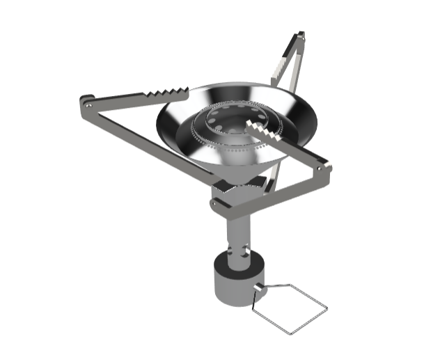
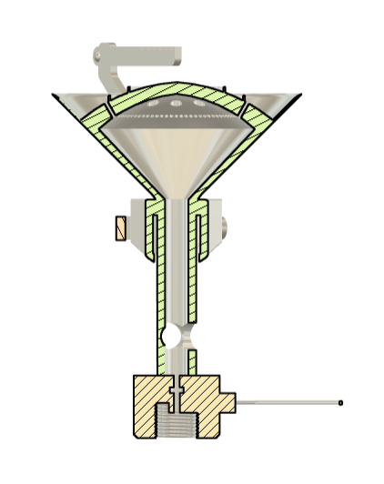

**Ultralight Titanium Burner: Aerodynamics & CHT Simulation**

**Overview**
This project details the mechanical design and computational fluid dynamics (CFD) analysis of an ultralight canister stove. The core objective is to maximize thermal efficiency and validate variable-power flame stability under harsh environmental boundary conditions, specifically a 5 m/s crosswind.

**Design Requirements & Commercial Benchmarking**
To ensure the simulation yields commercially viable data, the baseline performance targets were benchmarked against the MSR PocketRocket 2.
*   **Payload Target:** 1.0 kg (1 Liter of water).
*   **Target Boil Time:** $\le 210 \text{ seconds}$ (3.5 minutes).
*   **Required Power Output:** ~2800 Watts.
*   **Ideal Fuel Mass Flow Rate:** $0.000631 \text{ kg/s}$ (derived via Python first-principles thermodynamic script).

**CAD Architecture (Fusion 360)**
The mechanical geometry was designed using a dual-model approach:
1.  **High-Fidelity Manufacturing Model:** Features a parametric titanium folding structure with 0.1 mm thermal expansion clearances, 7/16" UNEF canister threads, and dual-zone swirl ports for simmer control.
2.  **Defeatured Simulation Model:** Stripped of micro-fillets, threads, and mechanical joints to eliminate skewed tetrahedral cells and ensure CFD mesh convergence.

**Conjugate Heat Transfer (CHT) Simulation (Ansys Fluent)**
*   Simulates the coupled thermal interaction between the solid domains (titanium/aluminum conduction) and fluid domains (combustion gas and crosswind convection)[cite: 2].
*   Validates the physical bluff bodies (retention lips) designed to anchor the flame and prevent low-power blowout in a 5 m/s crosswind[cite: 2].

**Engineering Constraints & Real-World Considerations**
*   **Mission-Driven Environment:** The aerodynamic baffle and variable power settings were specifically developed to survive the high-wind, unpredictable environments experienced during self-supported, multi-day wild camping expeditions on the Isle of Arran and Beinn Narnain[cite: 2].
*   **Stiffness-to-Weight Optimization:** Engineered under a strict mass budget of less than 100g, while maintaining the structural rigidity required to safely support a 1.0 kg payload (1 Liter of water) and dynamic stirring forces[cite: 2].
*   **DFMA & Mechanical Tolerances:** The folding titanium legs feature precise 0.1 mm clearances, ensuring the kinematic joints will not seize due to extreme thermal expansion or grit accumulation in the field.
*   **Analytical Validation:** Theoretical thermodynamic baseline calculations, mass flow rates, and efficiency limits were modeled using custom data automation scripts in Python and R Studio prior to CAD generation.

**Visual Artifacts & Data**

**Deployed CAD Assembly:**

**Internal Fluid Path Cross-Section:**

**Ansys Thermal Plume Deflection:**

